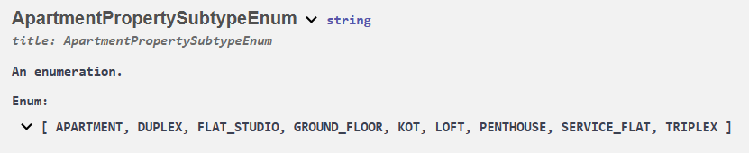

# Immozil(l) Real Estate House🏡/Apartment🏬 Price Prediction


## Description 📝

- This project is the deployed end-result of the real estate price prediction project at BeCode.
- The ultimate aim of the project was to make a real estate price prediction model using machine learning and deploying it to the web.

The deployed version can be consulted and tested at [this streamlit link.](https://immo-eliza-deployment-zxqpwxyxuoovpuqj53m8ew.streamlit.app/)

## Table of Contents

- [File structure 📜](#file-structure-📜)
- [API 🤖](#API-🤖)
- [Streamlit🎈](#streamlit-🎈)
- [Timeline📜 ](#timeline-📜)

## File Structure 📜

The repo contains both the code for building the api and the streamlit app.

```
├── README.md
├── api
│   ├── Dockerfile
│   ├── app.py
│   ├── requirements.txt
│   ├── rfr_app_model_with_pipeline-0.1.0.pkl
│   └── rfr_house_model_with_pipeline-0.1.0.pkl
├── image.png
├── streamlit
    ├── apartment.jpg
    ├── app_pc_city.csv
    ├── house.jpg
    ├── house_pc_city.csv
    ├── pages
    │   ├── predict_🏡_house_price.py
    │   └── predict_🏬_apartment_price.py
    ├── requirements.txt
    └── streamlit_app.py
```

## API 🤖

The machine learning model is exposed through a RESTful API with the following endpoint(s):

The API is hosted on [Render](https://dashboard.render.com/). A Dockercontainer was used for this.

- **Apartment Endpoint:** [/predict/apartment](https://immo-eliza-deployment-yr5r.onrender.com/docs#/default/predict_predict_apartment_post/) 
- **House Endpoint:** [/predict/house](https://immo-eliza-deployment-yr5r.onrender.com/docs#/default/predict_predict_house_post)
- **Method:** POST
- **Request Body:** JSON format containing property details
- **Response:** Predicted price

Example Request (for apartment):
```json
{
  "postal_code": 9000,
  "property_subtype": "APARTMENT",
  "number_of_rooms": 3,
  "living_area": 25,
  "kitchen_type": "HYPER_EQUIPPED",
  "furnished": 1,
  "open_fire": 1,
  "terrace": 1,
  "terrace_area": 10,
  "garden": 1,
  "garden_area": 10,
  "number_of_facades": 2,
  "swimming_pool": 1,
  "state_of_building": "GOOD",
  "province": "antwerpen"
}
```

Example Response:  
```json  
[
  163909.21
]
```

At the bottom of the [swagger-ui](https://immo-eliza-deployment-yr5r.onrender.com/docs), you can find the API schema and possible parametervalues that can be used:




## Streamlit 🎈

For the deployment of a web app on [streamlit](https://immo-eliza-deployment-zxqpwxyxuoovpuqj53m8ew.streamlit.app/) the API endpoints like available on Render were used. 

To use the app, navigate to the apartments or house tab at the left, fill in property details and press Predict at the bottom. A price is returned for you as calculated by the machine learning model.


## 📜 Timeline

This project was created in 5 days.
